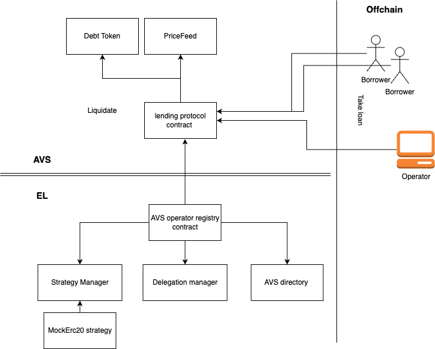

# Lending Protocol AVS

Welcome to the Lending Protocol AVS.



It include:
1. a DeFi lending protocol smart contract, a script to monitor the health of borrower positions.
2. Reaches consensus on when a position is eligible for liquidation.
3. Triggers the liquidation process on-chain when consensus is reached.

to run it locally, first we deploy EL contracts to local anvil running chain, create ERC20 mock strategy, and register the Lending protocol service in AVS directory.

## Quick Start

### Dependencies

1. [npm](https://docs.npmjs.com/downloading-and-installing-node-js-and-npm)
2. [Foundry](https://getfoundry.sh/)
3. [Docker](https://www.docker.com/get-started/)
   * Make sure Docker is running for automated deployment

Following global NodeJS packages:
1. [Typescript](https://github.com/microsoft/TypeScript)

## Typescript instructions

### Automated deployment (uses existing state file)

1. Run `npm install`
2. Run `cp .env.local .env` and run `anvil`
3. Run `make  deploy-all`
    * This will build the contracts, start an Anvil chain, deploy the contracts to it, and leaves the chain running in the current terminal
    It will also register operator and start an instance;


### Manual deployment

This walks you through how to manually deploy using Foundry (Anvil, Forge, and Cast)

1. Run `npm install` to install the TypeScript dependencies
2. Run `cp .env.local .env`
3. Compile the contracts.

```sh
cd contracts && forge build
```

4. Start Anvil by opening your terminal and running the following command:

```sh
anvil
```

5. In a separate terminal window, deploy the EigenLayer contracts.

To do so, change into `contracts/lib/eigenlayer-middleware/lib/eigenlayer-contracts` and run the following commands:

```sh
make deploy-eigenlayer-contracts-to-anvil-and-save-state
```

6. In a separate terminal window, deploy the AVS contracts.

```sh
cd contracts

forge script script/LendingProtocolDeployer.s.sol --rpc-url http://localhost:8545 --private-key 0xac0974bec39a17e36ba4a6b4d238ff944bacb478cbed5efcae784d7bf4f2ff80 --broadcast -v
```

7. Start the operator

```sh
tsc && node dist/index.js
```

## Extensions

- Operator needs a minimum stake amount to make submissions
- Add another strategy to the AVS
- Operator must respond within a certain number of blocks

## Deployment on Holesky

To deploy the Lending Protocol AVS contracts to the Holesky network, follow these steps:

1. Ensure you have the necessary RPC URL and private key for the Holesky network.
2. Run the deployment script using Foundry:
    ```bash
    forge script script/HoleskyDeployer.s.sol:HoleskyDeployer --rpc-url $RPC_URL --private-key $PRIVATE_KEY --broadcast -vvvv
    ```
    Replace `$RPC_URL` with your Holesky RPC URL and `$PRIVATE_KEY` with your private key.

## Adding a New Strategy

To add a new strategy to the Lending Protocol AVS, follow the guide provided in [`AddNewStrategy.md`](https://github.com/Layr-Labs/lending-protocol-avs/blob/master/AddNewStrategy.md). This guide walks you through the necessary steps to add and whitelist a new strategy for the AVS.
